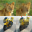

# Examples

This folder contains examples of the energy transformer. I may move them to Jupyter notebooks in the future for interactivity, but currently they're Python scripts.

## cifar_image_reconstruction

This is a masked image reconstruction task. Given an input image, it is broken into patches and some are masked. The network is trained to minimize its reconstruction error over the masked patches, given the unmasked context patches. This is a task in the paper, except they use ImageNet instead of CIFAR. CIFAR is better for testing and example purposes, due to its small size, which leads to fast training and less disk space needed. Here is an example progression (from the end of epoch 1, so early in training) of each step as the model descends the energy gradients: 

The leftmost image is the original and each rightward image shows where how the model continuously updates at each step. Note that the masked patches are still clearly visible.

Following the paper, note that only the model's score on masked patches goes into the loss function. Despite it technically being trained on only reconstructing masked patches, the model still learns to accurately represent the unmasked patches. At epoch 10, the model has much less visible masked patches:

while the reconstruction (right) is still a bit blurry, it is easily recognizable that the images correspond and hard to tell which patches were masked and which were not.